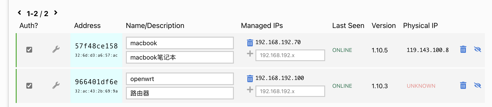

## 准备工作

### 注册帐号

我直接用 github 帐号登录。

### 创建网络

登录后提示创建一个新的网络，选择 private，可以修改网络名字如我改为 skynet 。

ipv4 自动分配地址，选择一个网段。


记录下这个网络的 ZeroTier Network ID。

## 安装客户端

### openwrt

打开 openwrt 的 "vpn" -< "zerotier"：

http://192.168.0.1/cgi-bin/luci/admin/vpn/zerotier 

填写 ZeroTier Network ID，勾选 启动 和 自动允许客户端 NAT， 点 "保存&应用"

连接成功后会显示 “***Zerotier 运行中***”， "接口信息" 中也可以看到相关的信息。

在 zerotier 的管理页面上，这时可以看到有一个提示 "One device has joined this network." 在设置列表中找到这个设备，勾选前面的框让认证通过。

为了方便起见，给每个设备指定固定的ip地址，方便后续直接连接。比如路由器我设置为 192.168.192.100。



### mac

下载安装 zerotier 的 app，启动后点击"Jion New Network" ，输入前面的 ZeroTier Network ID。然后同样需要在管理页面认证通过。

### windows

类似的安装应用，设置和 mac 类似。

> 貌似在路由器安装好 zerotier 之后，内网其他机器没有必要再安装 zerotier 了。

## 配置网络

### 配置路由器

在 openwrt 的设置中，我们选择了 "自动允许客户端 NAT"，但这还不够，还需要在 zerotier 的管理页面中对网络进行路由设置。

默认情况会有一个 managed route , "192.168.192.0/24(LAN)"。

我的路由器的内网中有两个子网，分别是 "192.168.0.0/24" 和  "192.168.100.0/24"，为了在其他设备上直接访问这些网段，需要添加两个人 route，如下图所示：


>  备注：这里的 192.168.192.100 是前面设置的路由器在 zerotier 网络中的固定IP。

可以通过 mac 上的 zerotier app 看到这些路由信息：


由于这些路由信息的存在，因此我们可以直接使用这些内网 IP 地址进行访问，好处就是可以在外网得到和在内网一样的体验。


## 验证


### 网速延迟 

从 ping 看延迟还是比较大的，大概40-50ms，可能是因为我测试时笔记本用的是手机网络。

```bash
$ ping 192.168.192.100
PING 192.168.192.100 (192.168.192.100): 56 data bytes
64 bytes from 192.168.192.100: icmp_seq=0 ttl=64 time=41.456 ms
64 bytes from 192.168.192.100: icmp_seq=1 ttl=64 time=54.879 ms
64 bytes from 192.168.192.100: icmp_seq=2 ttl=64 time=37.987 ms
64 bytes from 192.168.192.100: icmp_seq=3 ttl=64 time=40.589 ms
```

TBD：下次测试一下两边都是电信宽带的情况。


