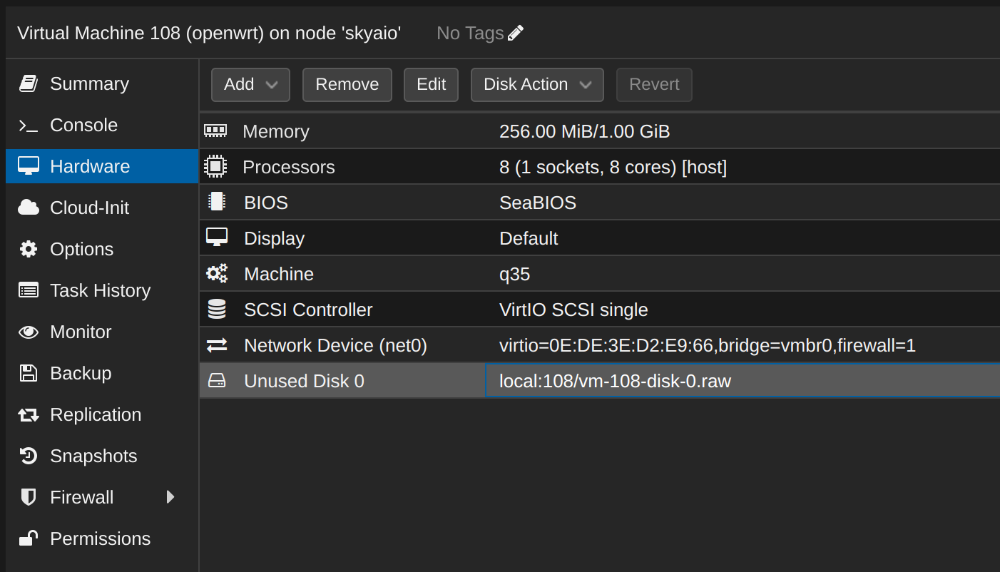
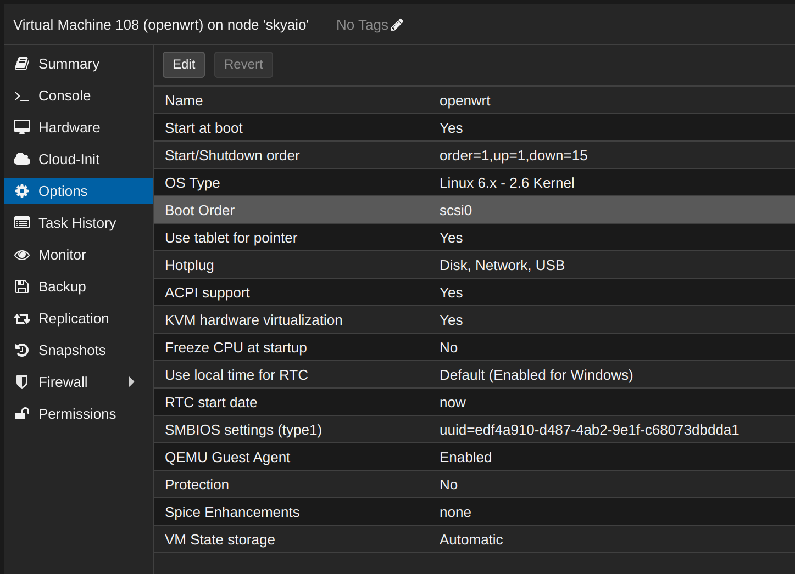

## 安装

参考： https://post.smzdm.com/p/a7nqp3r9/ 

### 准备镜像

下载下来的 img 格式的镜像文件在 PVE 下可以直接使用，比 esxi 下方便。

### 新建虚拟机

在 PVE 下新建虚拟机：

- 常规（general）

  取名 openwrt，高级选项中勾选 "开机自启动"

- OS（操作系统）

  客户机操作系统选 linux，客户机操作系统版本选 `6.x - 2.6 Kernel`。

  光驱选择不使用任何介质。

- system（系统）

  scci控制器选择 "virtIO SCSI", 机型选择 q35，勾选 Qemu 代理。Bios 选择默认的 SeaBIOS。

- disk（磁盘）

  默认配置不用改，直接next，因为等下会删除这个磁盘，然后用 openwrt 的 img 镜像文件重新创建磁盘。

- cpu

  考虑可能有科学上网的消耗，cpu给足一点，插槽1,核心8,类型选 host。

- memory（内存）

  内存给2048 （2g）。

- network（网络）

  桥接这里选已经建立好的桥接网卡，注意这个网卡是给 lan 用的。模型选 VirtIO（半虚拟化），其性能和效率最高。

  > VirtIO 模型在 Openwrt 内会显示 “Unknown!半双工”，但实测不影响使用。

确认配置后就可以创建 openwrt 虚拟机了。

### 修改虚拟机配置

打开新创建的 openwrt 虚拟机的硬件配置，首选删除已有的硬盘，删除之后会出现一个“未使用的磁盘”，继续删除这个磁盘。

然后删除 CD/DVD 驱动器。

### 上传 openwrt 镜像文件

将前面准备好的 openwrt 的 img 文件上传到 pve 下。

可以通过页面上传，完成后文件会存储在 pve 下的固定目录，ssh 登录 pve 后可以看到

```bash
cd /var/lib/vz/template/iso/
ls -lh
```

类似：

```bash
ls -lh
total 2.9G
-rw-r--r-- 1 root root 1.1G Jul 18 01:23 openwrt.img
-rw-r--r-- 1 root root 1.9G Jul 18 08:31 ubuntu-22.04.2-live-server-amd64.iso
```

这里为了方便起见，将原来下载的 img 文件的名字改短了。

执行下列命令将这个 img 镜像倒入到虚拟机中：

```bash
qm importdisk 1000 /var/lib/vz/template/iso/openwrt.img local
```

> 备注： 
>
> 1. 108 为虚拟机的 ID, 替换为实际 ID
> 2. local 是存储的名字，我将默认创建的 local-lvm 删除了，空间合并到 local。

输出为：

```bash
importing disk '/var/lib/vz/template/iso/openwrt.img' to VM 108 ...
Formatting '/var/lib/vz/images/108/vm-108-disk-0.raw', fmt=raw size=1090813440 preallocation=off
transferred 0.0 B of 1.0 GiB (0.00%)
transferred 12.0 MiB of 1.0 GiB (1.15%)
transferred 24.0 MiB of 1.0 GiB (2.31%)
......
transferred 1.0 GiB of 1.0 GiB (99.20%)
transferred 1.0 GiB of 1.0 GiB (100.00%)
transferred 1.0 GiB of 1.0 GiB (100.00%)
Successfully imported disk as 'unused0:local:108/vm-108-disk-0.raw'
```

之后就可以在 openwrt 的虚拟机中看到这个未使用的磁盘。



编辑这个磁盘，不用改动，点添加即可。然后用菜单中的 resize 功能调整磁盘的大小，修改为 8 G。

备注：这个 resize 操作还必须进行，如果直接启动，会报错如下：

```bash
kvm: -device scsi-hd,bus=scsihw0.0,channel=0,scsi-id=0,lun=0,drive=drive-scsi0,id=scsi0,bootindex=100: Cannot get 'write' permission without 'resize': Image size is not a multiple of request alignment
TASK ERROR: start failed: QEMU exited with code 1
```

### 修改引导顺序

修改 openwrt 虚拟机的引导顺序，在虚拟机的选项（options） -》引导顺序（boot order）中，勾选刚才的磁盘，取消网络启动。



至此 openwrt 安装完成，之后启动即可。

