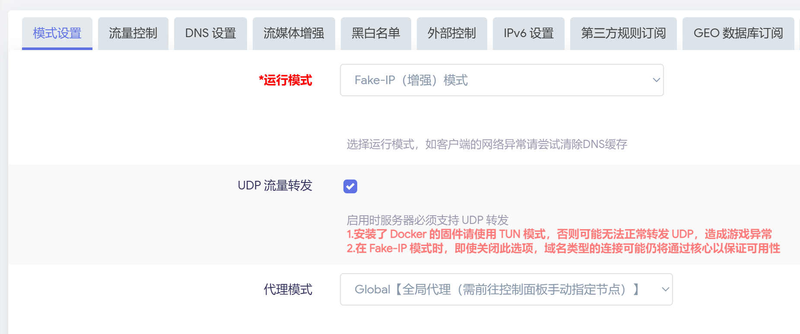
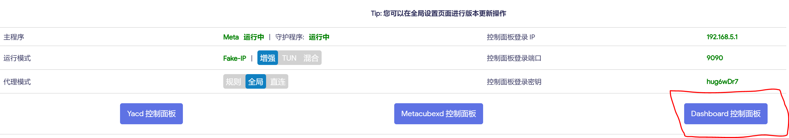

TODO：准备参考下面视频的做法，实现 openclash 的最佳配置

https://www.youtube.com/watch?v=S2l_0g4EOHk

## 安装 openclash

我使用的 openwrt 固件默认安装了 openclash：

http://192.168.0.1/cgi-bin/luci/admin/services/openclash

## 配置 openclash

在"配置订阅"中，添加订阅地址，然后保存，再更新配置。

也可以启用自动更新，比如每周一更新一次。

## 开启 openclash

启动后可以通过 openclash 菜单中的 "运行日志" 来查看启动过程，尤其是启动失败的原因。

{}
如果启动时卡住，尤其是下载失败，请注意很可能是 dns 污染造成下载失败。
{}

## 常见故障

### 启动失败

openclass 启动失败，运行日志显示：

```bash
2025-10-26 10:45:26 错误：【1/3】【Meta】版本内核下载失败...
2025-10-26 10:45:26 【/tmp/clash_meta.tar.gz】下载失败：【curl: (28) Connection timed out after 10001 milliseconds】
2025-10-26 10:45:09 下载进度：【clash_meta.tar.gz - 0%】
2025-10-26 10:45:09 提示：【Meta】版本内核正在下载，如下载失败请尝试手动下载并上传...
2025-10-26 10:44:54 提示：检测到内核文件不存在，准备开始下载...
```

解决方案是打开 "插件设置"  -> "版本更新"，点击 "检查并更新" 来更新内核版本：

- [Meta] 当前内核版本

注意要关闭lan口的IPV6分配和IPV6 DHCP，否则会有如下提示：

```bash
2024-01-28 15:14:02 警告：OpenClash 启动成功，检测到您启用了IPv6的DHCP服务，可能会造成连接异常！
```

参考：

- https://github.com/vernesong/OpenClash/issues/1758
- https://github.com/vernesong/OpenClash/issues/913

这个文件有时半天都下载不下来，所有最好的办法是提前准备好这个文件，然后上传到 openwrt 的 `/etc/openclash/core/` 目录下， 修改文件名为 `clash_meta`。

```bash
tar xvf clash-linux-amd64-v1.tar.gz
scp ./clash-linux-amd64-v1/clash root@192.168.0.1:/etc/openclash/core/clash_meta
```

可以 ssh 登录上去 openwrt，执行命令查看版本：

```bash
$ /etc/openclash/core/clash_meta -v
Mihomo Meta alpha-gc13549f linux amd64 with go1.24.7 Mon Oct  6 20:13:48 UTC 2025
Use tags: with_gvisor

$ ls -lh /etc/openclash/core/clash_meta
-rwxr-xr-x    1 root     root        8.4M Oct  7 04:13 /etc/openclash/core/clash_meta
```

## 避免bt流量走代理

由于同时开启了 openclash 做代理，因此会遇到一个问题：有些 bt 的流量会被 openclash 代理，从而无端的耗费了宝贵的代理流量。

全局设置 -》 模式设置 中，勾选：

- ***\*仅允许常用端口流量\****
- 实验性：绕过中国大陆 IP

全局设置 -》访问控制 中：

- 不走代理的局域网LAN IP
- 不走代理的局域网设备 Mac

参考资料：

- https://www.v2ex.com/t/757230

## 代理服务器信息

- HTTP(S) 代理端口： 7890

- SOCKS5 代理端口： 7891

- HTTP(S)&SOCKS5 混合代理端口： 7893

平时使用时，通过下面的命令进行代理设置：

```bash
export all_proxy=socks5://192.168.0.1:7891;export http_proxy=http://192.168.0.1:7890;export https_proxy=http://192.168.0.1:7890
```
方便起见，修改 `~/.zshrc` 或者 `/etc/profile` ：

```bash
# proxy enable
alias proxyon='export all_proxy=socks5://192.168.0.1:7891;export http_proxy=http://192.168.0.1:7890;export https_proxy=http://192.168.0.1:7890'
alias proxyoff='unset all_proxy http_proxy https_proxy'
```

## socks5 / https 认证信息

默认 openclash 会设置 socks5 / https 认证，导致出现如下的错误提示：

```bash
$ wget https://github.com/envoyproxy/envoy/releases/download/v1.23.3/envoy-1.23.3-linux-x86_64
--2023-06-27 21:20:18--  https://github.com/envoyproxy/envoy/releases/download/v1.23.3/envoy-1.23.3-linux-x86_64
Connecting to 192.168.0.1:7890... connected.
Proxy tunneling failed: Proxy Authentication RequiredUnable to establish SSL connection.
```

简单起见，去掉认证。

具体做法：

- 点击 openclash 菜单中的 "覆写设置" 
- "基本设置" 拉到最下方，找到 "设置 SOCKS5/HTTP(S) 认证信息"
- 取消用户名和密码的勾选
- 保存配置 / 应用配置

```bash
$ wget https://github.com/envoyproxy/envoy/releases/download/v1.23.3/envoy-1.23.3-linux-x86_64
```

验证结果：

```bash
--2023-06-27 21:22:02--  https://github.com/envoyproxy/envoy/releases/download/v1.23.3/envoy-1.23.3-linux-x86_64
Connecting to 192.168.0.1:7890... connected.
Proxy request sent, awaiting response... 302 Found
Location: https://objects.githubusercontent.com/github-production-release-asset-2e65be/65214191/
......
Connecting to 192.168.0.1:7890... connected.
Proxy request sent, awaiting response... 200 OK
Length: 61566056 (59M) [application/octet-stream]
Saving to: ‘envoy-1.23.3-linux-x86_64’

envoy-1.23.3-linux-x86_64     100%[=================================================>]  58.71M  23.4MB/s    in 2.5s 
```

## 自定义规则

打开 openclass 的菜单项 "覆写设置" -> "规则设置"，勾选 "自定义规则"，在第一个文本编辑框的末尾输入：

```bash
- DOMAIN,v4.plex.tv,DIRECT
- DOMAIN-SUFFIX,copilot.microsoft.com,节点选择
```

这样就可以指定访问 `v4.plex.tv` 这个域名时不使用代理而是直连。

注意：此时代理模式必须是 Rule，而不能是 Globle 或者 Direct。可以在菜单项 "插件设置" -> "模式设置" 中选择 "代理模式" 为 "Rule[策略代理]"。

## 开启全局代理

某些情况下，需要在 openwrt 上开启全局代理，以便让部分不方便设置代理的场合也可以使用到 openwrt 和 openclash 插件提供的代理。

> 注意：操作时需要注意，稍有不慎就会无法生效。

openclash 开启全局代理的步骤：

1. 修改代理模式为全局（global）

   打开 "openclash" -> "运行状态"，修改代理模式为全局：

  

  默认为规则（rule），修改之后，注意检查其他几个位置是否已经修改为全局。

  打开 "openclash" -> "插件设置" -> "模式设置" -> "代理模式"，设置为 "Global[全局代理（需前往控制面板手工指定节点]"：

  

  这里已经在提醒我们一个非常重要的事项：全局模式必须在控制面版手工指定节点。这里说的控制面板是 "openclash" -> "运行状态" 下的这个 "Dashboard 控制面板"：

  

2. 手工指定节点

  点上面的 "Dashboard 控制面板" 进入控制面板，然后指定 global 模式下要使用的节点，如图所示：

  

3. （补充）DNS 设置

  上面的设置正常已经可以开启全局代理了，但有时依然会出现无法访问的问题，大多数是因为 dns 解析出现问题。

  打开 "openclash" -> "插件设置" -> "DNS设置" -> "本地 DNS 劫持"，选择推荐的 "使用 Dnsmasq 转发"

  