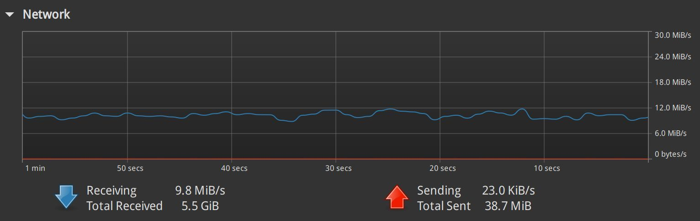

## CloudDrive2 设置

### 安装 CloudDrive2

在 openwrt 上安装 CloudDrive2 插件，并进行配置。

可以通过 istore 进行安装，在 istore 中找到 CloudDrive2 插件，点击安装即可（注意这次安装的 openwrt 的 clouddrive2 插件）。

然后在 openwrt 下找到 CloudDrive2 插件，继续再安装（这次是安装 clouddrive2 的 docker 容器），全部默认，但要勾选上共享 `/mnt` 目录。

安装完成后，状态显示： clouddrive2 运行中。点击 "打开clouddrive2" 按钮，进入 clouddrive2 的 web 界面。

### 注册和登录

可以先注册一个 clouddrive2 的账号，然后登录。

### CloudDrive2 系统设置

右上角点用户图表，菜单中选择 "设置"，进入 CloudDrive2 系统设置页面。

- 目录缓存时间（秒）： 修改为0,表示永不过期

- 启用缓存持久化

### 添加 115 为云存储

通常 clouddrive2 的 web 界面地址为，其中端口默认是 19798：

http://192.168.3.1:19798/

右上角选择语言为中文。

云存储中，点击"添加"，然后选择 "115open"，认证方式选择 "OAuth认证"。在点击 "使用以下方式授权 115open" 按钮，在弹出的页面中登录115并完成授权。

115open 中，点击管理：

- 最大下载线程数: 默认2,修改为10（备注：发现改不了，只能用默认值2，估计是需要用付费版本）

- 勾选 使用 HTTP 下载

- 最小读取长度 (KB):： 2048 KB

- 最大缓冲池大小 (MB): 256MB

### 挂载115网盘

进入 挂载 页面，点击 "添加挂载点"，选择：

- 源目录：`/115open`

- 挂载点： `/mnt/CloudNAS/115open`

此时，可以 ssh 登录 openwrt，或者在 openwrt 的页面上浏览目录 `/mnt/CloudNAS/115open`，就可以看到挂载的 115 网盘的文件。

## openwrt 设置

修改 nfs export 设置：

```bash
vi /etc/exports
```

内容设置为：

```bash
/mnt/CloudNAS/115open 192.168.0.0/16(rw,async,no_root_squash,insecure,no_subtree_check,fsid=101)
```

重启 nfs server：

```bash
exportfs -arv
/etc/init.d/nfsd restart
```

正常此时 openwrt 上已经 mount 成功115网盘，可以看到网盘文件如：

```bash
ls -l /mnt/CloudNAS/115open
drwxr-xr-x    1 root     root             0 Nov 11 19:26 backup
drwxr-xr-x    1 root     root             0 Nov 14 04:37 data
drwxr-xr-x    1 root     root             0 Oct 21 23:29 game
drwxr-xr-x    1 root     root             0 Oct 21 23:45 movie
drwxr-xr-x    1 root     root             0 Nov 10 01:42 musiz
drwxr-xr-x    1 root     root             0 Oct 30 22:15 temp
drwxr-xr-x    1 root     root             0 Oct 21 23:29 tv
......
```

## nfs client 设置

### linux mint

先安装 nfs client：

```bash
sudo apt install nfs-client
```

查看 nfs server 的 export 信息：

```bash
$ showmount -e 192.168.3.1

Export list for 192.168.3.1:
/mnt/CloudNAS/115open 192.168.0.0/16
```

尝试 mount 到本地：

```bash
mkdir -p ~/temp/115
cd ~/temp/

sudo mount -v -t nfs -o vers=3,nolock,proto=tcp 192.168.3.1:/mnt/CloudNAS/115open ./115
```

mount 成功之后，可以查看 mount 后的 115 网盘的文件：

```bash
$ ls ./115
backup  data  game  movie  musiz  temp  tv
```

#### 播放蓝光圆盘

进入 movie 目录，找到蓝光圆盘，以碟中碟8 为例，iso 文件大小为 101.0 GB。

右键点 iso 文件，弹出菜单中选择 "mount archive", 加载 iso 文件后，进入 “BDMV/STREAM” 目录 ，找到最大的文件，如 00294.m2ts 大小为 99.8 GB。用播放器如 Celluloid 打开，即可播放。

打开 linux mint 的系统监控器（system monitor），可以看到播放时的网络流量。100 GB 的 4k 蓝光圆盘，播放时大概是 12 MB 上下的下载速度，也就是 100 兆的宽带带宽大体就足以满足 4k 蓝光圆盘的 115 网盘不下载直接播放。



播放了一段时间，大概几分钟，播放器就卡住了，系统监控器上看到网络流量为零。检查后发现 clouddrive2 的 115 云储存可以访问，openwrt 上的挂载也可以访问，但 openwrt 的 nfs server 出问题了。

重新启动 openwrt 的 nfs server，恢复正常。

检查了一下 openwrt 的 cpu 占用，非常低，我给了 openwrt 虚拟机4个小核，cpu 使用率一直在 0% 到 3% 之间跳动， cloud drive 会占用大概 470 MB 的内存。


### windows 11