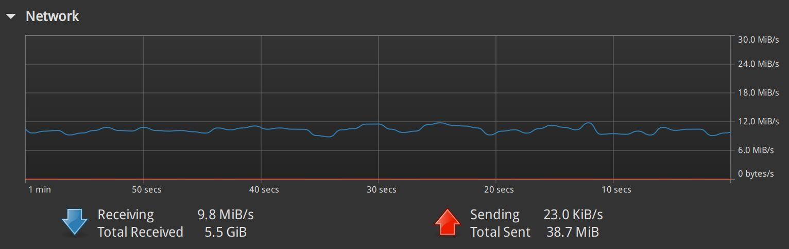

## openwrt 服务器端

### nfs export

在 openwrt 的服务器端修改 nfs export 设置：

```bash
vi /etc/exports
```

内容设置为：

```bash
/mnt/CloudNAS/115open/CloudDrive 192.168.0.0/16(ro,async,insecure,all_squash,anonuid=0,anongid=0,no_subtree_check,fsid=101)
```

重启 nfs server：

```bash
exportfs -arv
/etc/init.d/nfsd restart
```

正常此时 openwrt 上已经通过 nfs 将成功115网盘所在的 /mnt/CloudNAS/115open/CloudDrive 目录 export 出来。

备注：这里发生过错误，exportfs 时报错：

```bash
exporting 192.168.0.0/16:/mnt/CloudNAS/115open
exportfs: /mnt/CloudNAS/115open does not support NFS export
```

主要需要将路径设置为 `/mnt/CloudNAS/115open/CloudDrive/`，而不是 `/mnt/CloudNAS/115open`！

另外，nfs export 为 ro 只读即可，rw 虽然可以设置，但是写入文件报错。写网盘还是用 sbm 共享合适。

## nfs client 设置

### linux mint

先安装 nfs client：

```bash
sudo apt install nfs-client
```

查看 nfs server 的 export 信息：

```bash
$ showmount -e 192.168.3.1

Export list for 192.168.3.1:
/mnt/CloudNAS/115open/CloudDrive 192.168.0.0/16
```

尝试 mount 到本地：

```bash
mkdir -p ~/temp/115
cd ~/temp/

sudo mount -v -t nfs -o vers=3,nolock,proto=tcp 192.168.3.1:/mnt/CloudNAS/115open/CloudDrive ./115
```

mount 成功之后，可以查看 mount 后的 115 网盘的文件：

```bash
$ ls ./115
backup  data  game  movie  musiz  temp  tv
```

方便起见，将 mount 信息固化到 fstab，但是不自动装载：

```bash
mkdir -p ~/mounts
sudo vi /etc/fstab
```

在文件末尾追加内容，注意一定要加上 noauto 表示开机不自动挂载：

```bash
# skyroute3 115 网盘挂载
192.168.3.1:/mnt/CloudNAS/115open/CloudDrive /home/sky/mounts/skyrouter3-115-nfs nfs vers=3,nolock,proto=tcp,user,noauto,ro 0 0
```

重载入：

```bash
sudo systemctl daemon-reload
```

在 zsh 中增加两个快捷命令：

```bash
vi ~/.zshrc
```

增加内容:

```bash
# 115 netdisk mount and umount
alias skyrouter3-115-nfs-mount='mkdir -p $HOME/mounts/skyrouter3-115-nfs && mount $HOME/mounts/skyrouter3-115-nfs'
alias skyrouter3-115-nfs-umount='umount -l $HOME/mounts/skyrouter3-115-nfs'
```

skyrouter3-115-nfs-mount / skyrouter3-115-nfs-umount 两个命令直接用，测试如下：

```bash
source ~/.zshrc   
skyrouter3-115-nfs-mount 
skyrouter3-115-nfs-umount  
```

#### 播放蓝光圆盘

进入 movie 目录，找到蓝光圆盘，以碟中碟8 为例，iso 文件大小为 101.0 GB。

右键点 iso 文件，弹出菜单中选择 "mount archive", 加载 iso 文件后，进入 “BDMV/STREAM” 目录 ，找到最大的文件，如 00294.m2ts 大小为 99.8 GB。用播放器如 Celluloid 打开，即可播放。

打开 linux mint 的系统监控器（system monitor），可以看到播放时的网络流量。100 GB 的 4k 蓝光圆盘，播放时大概是 12 MB 上下的下载速度，也就是 100 兆的宽带带宽大体就足以满足 4k 蓝光圆盘的 115 网盘不下载直接播放。



播放了一段时间，大概几分钟，播放器就卡住了，系统监控器上看到网络流量为零。检查后发现 clouddrive2 的 115 云储存可以访问，openwrt 上的挂载也可以访问，但 openwrt 的 nfs server 出问题了。

重新启动 openwrt 的 nfs server，恢复正常。

检查了一下 openwrt 的 cpu 占用，非常低，我给了 openwrt 虚拟机4个小核，cpu 使用率一直在 0% 到 3% 之间跳动， cloud drive 会占用大概 470 MB 的内存。


### windows 11

#### 安装配置

打开控制面板，进入 “程序和功能”，点 “启用或者关闭 windows 功能”，找到 “nfs 服务”，勾选 “nfs客户端” 和 “管理工具”，安装完成后重启电脑。

重启后，打开 cmd，检查 nfs client 安装是否ok：

```bash
C:\Users\sky>mount --help
用法:  mount [-o options] [-u:username] [-p:<password | *>] <\\computername\sharename> <devicename | *>

-o rsize=size               设置读取缓冲区的大小(以 KB 为单位)。
-o wsize=size               设置写入缓冲区的大小(以 KB 为单位)。
-o timeout=time             设置 RPC 调用的超时值(以秒为单位)。
-o retry=number             设置软装载的重试次数。
-o mtype=soft|hard          设置装载类型。
-o lang=euc-jp|euc-tw|euc-kr|shift-jis|big5|ksc5601|gb2312-80|ansi
                            指定用于文件和目录名称的编码。
-o fileaccess=mode          指定文件的权限模式。
                            这些模式用于在 NFS 服务器上创建的
                            新文件。使用 UNIX 样式模式位指定。
-o anon                     作为匿名用户装载。
-o nolock                   禁用锁定。
-o casesensitive=yes|no     指定在服务器上执行区分大小写的文件查找。
-o sec=sys|krb5|krb5i|krb5p

C:\Users\sky>mount

本地    远程                                 属性
-------------------------------------------------------------------------------
```

简单起见，先关闭 windows 防火墙，在没有防火墙的干扰下先把 nfs 的功能跑起来。

查看 nfs 服务器的 export 情况：

```bash
$ showmount -e 192.168.3.1
导出列表在 192.168.3.1:
/mnt/CloudNAS/115open/CloudDrive              192.168.0.0/16
```

在 cmd 中执行（不需要用管理员身份打开 cmd）：

```bash
mount \\192.168.3.1\mnt\CloudNAS\115open Z:
```

如果成功，会显示：

```bash
Z: 现已成功连接到 \\192.168.3.1\mnt\CloudNAS\115open

命令已成功完成。
```

这是打开 z 盘符，就能看到 115 网盘的内容。

#### 防火墙设置

再来解决防火墙的问题，开启防火墙

#### 解决中文乱码问题

但现在还有个问题，挂载后的 115 网盘内容会有中文乱码，比如文件或者文件名。

打开 “控制面板” --> "时钟和区域" --> "更改日期、时间或者数字格式" --> "管理" , 找到 "非 unicode 程序中所使用的当前语言"，点击 "更改系统区域设置"，勾选 "Beta版：使用 unicode utf-8 提供全球语言支持"。

重新启动 windows 后再重新 mount ，发现乱码问题解决，能正常显示中文的文件和文件夹.

> 备注：4k 带杜比视界的 iso 蓝光原盘，无法用完美解码（potplayer）播放（哪怕升级到最新版本），也无法用 windows 11 自带的 iso 装载器装载。我安装 Leawo Blu-ray Player 之后可以正常播放，也能显示蓝光原盘的菜单。


