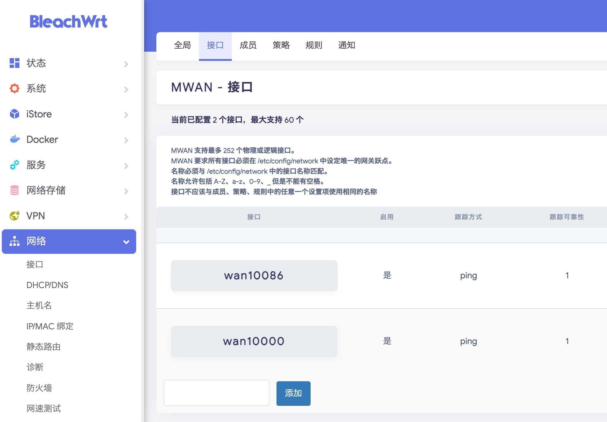
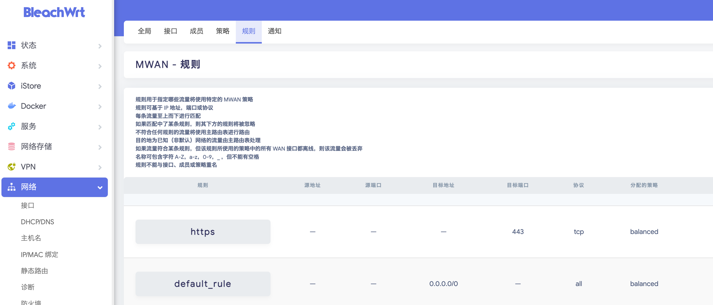

## 背

有两个宽带接入，一条是电信宽带，一条是移动宽带，两个光猫都设置为桥接模式，由路由器拨号。

现在准备用一个 openwrt 路由器，实现两个wan接口，同时接入两个宽带。

## wan配置

在 "网络" -> "接口" 页面上，删除现有的wan（可能还有wan6）。

重新创建两个 wan 接口：

- 名称设置为 wan10086 / wan10000，后面用这两个wan口分别接移动宽带和电信宽带。
- 防火墙设置一定要设置为 wan。
- wan10000 的网关跃点设置为 20，wan10086 的网关跃点设置为 22 （跃点越低优先级越高）

## 设置负载均衡

### 接口设置

在 "网络" -> "负载均衡" -> "接口" 页面，先删除所有的现有规则（默认为空，如果有就删掉）。

再新建两个规则，注意规则名称必须和上面的 wan 接口的名称保持一致，否则会无法使用:

- wan10000
- wan10086

### 成员设置

打开 "网络" -> "负载均衡" -> "成员" 页面，删除现有成员，新建两个成员：

- WAN_M1_10000: 接口选择 M10000, 跃点1，权重1
- WAN_M1_10086: 接口选择 M10086, 跃点1，权重1

### 策略设置

在 "网络" -> "负载均衡" -> "策略" 页面，新建两个策略：

- P10000: 使用成员 WAN_M1_10000，备用成员选择 "默认（使用主路由表）"
- P10086: 使用成员 WAN_M1_10086，备用成员选择 "默认（使用主路由表）"

修改已有的 lalanced 策略，将成员修改为 WAN_M1_10000 + WAN_M1_10086。

### 规则设置

在 "网络" -> "负载均衡" -> "规则" 页面，默认就有两个规则，确认分配的策略都被设置为 lalanced 。

补充一些特殊规则，主要是为了让两个房子之间的网络访问只走电信网络，不走移动网络：

- 99_SKYSERVERS： 目标地址 192.168.99.0/24，分配的策略为p10000
- 100_SKYSERVERS： 目标地址 192.168.100.0/24，分配的策略为p10000
- 0_SKYSERVERS： 目标地址 192.168.0.0/24，分配的策略为p10000
- ZEROTIER： 目标地址 192.168.192.0/24，分配的策略为p10000

### 验证

在 "状态" -> "负载均衡" -> "接口" 页面，如果两个 mwan 接口都显示在线（绿色），则表明设置成功。

打开 10000.gd.cn 页面进行测速，也可以验证是否成功。

https://10000.gd.cn/#/speed

## 参考资料

- [最简单的OpenWrt双wan融合宽带叠加＆负载均衡 指定IP走对应线路方法](https://www.yitoujing.com/article/33)