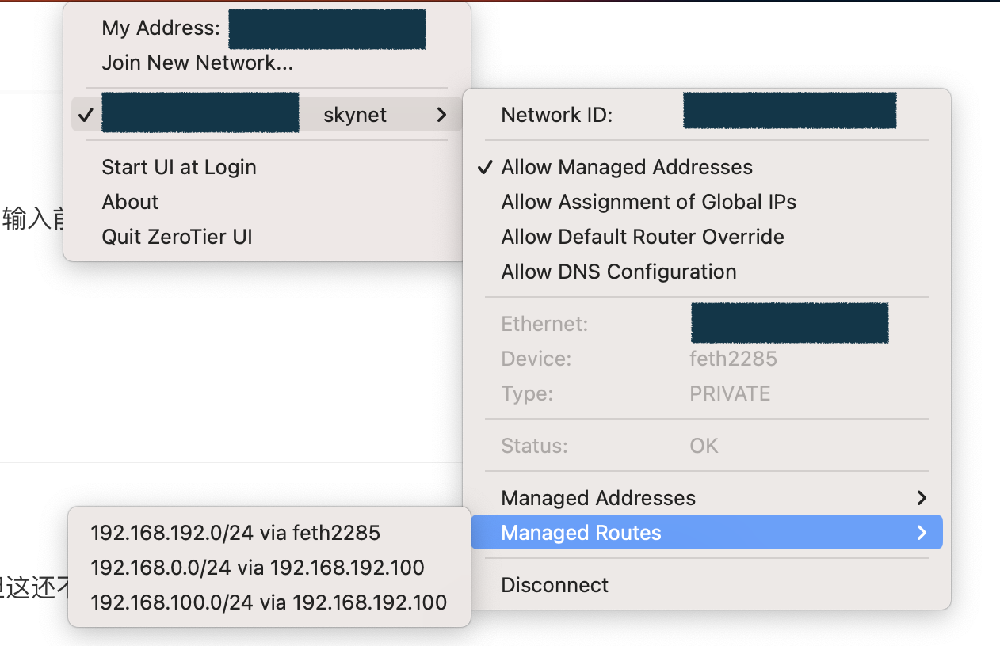

## 准备工作

### 注册帐号

我直接用 github 帐号登录。

### 创建网络

登录后提示创建一个新的网络，选择 private，可以修改网络名字如我改为 skynet 。

ipv4 自动分配地址，选择一个网段。


记录下这个网络的 ZeroTier Network ID。

## 安装客户端

### openwrt

打开 openwrt 的 "vpn" -< "zerotier"：

http://192.168.0.1/cgi-bin/luci/admin/vpn/zerotier 

填写 ZeroTier Network ID，勾选 启动 和 自动允许客户端 NAT， 点 "保存&应用"

连接成功后会显示 “***Zerotier 运行中***”， "接口信息" 中也可以看到相关的信息。

在 zerotier 的管理页面上，这时可以看到有一个提示 "One device has joined this network." 在设置列表中找到这个设备，勾选前面的框让认证通过。

为了方便起见，给每个设备指定固定的ip地址，方便后续直接连接。比如路由器我设置为 192.168.192.100。


### mac

下载安装 zerotier 的 app，启动后点击"Jion New Network" ，输入前面的 ZeroTier Network ID。然后同样需要在管理页面认证通过。

### windows

类似的安装应用，设置和 mac 类似。

> 貌似在路由器安装好 zerotier 之后，内网其他机器没有必要再安装 zerotier 了。

## 配置网络

### 配置路由器

在 openwrt 的设置中，我们选择了 "自动允许客户端 NAT"，但这还不够，还需要在 zerotier 的管理页面中对网络进行路由设置。

默认情况会有一个 managed route , "192.168.192.0/24(LAN)"。

我的路由器的内网中有两个子网，分别是 "192.168.0.0/24" 和  "192.168.100.0/24"，为了在其他设备上直接访问这些网段，需要添加两个人 route，如下图所示：


>  备注：这里的 192.168.192.100 是前面设置的路由器在 zerotier 网络中的固定IP。

可以通过 mac 上的 zerotier app 看到这些路由信息：



由于这些路由信息的存在，因此我们可以直接使用这些内网 IP 地址进行访问，好处就是可以在外网得到和在内网一样的体验。

### 网速延迟 

以广州南沙的 openwrt 软路由机器为基础进行测试，使用的是电信网络。

ping 天河的节点，同是电信宽带，延迟为 5-6 毫秒。同城电信网络之间的 ping 值非常好，甚至比家里用无线网络的延迟都低，如果不是受限于上行带宽，体现和普通局域网基本一致：

```bash
$ ping 192.168.192.20
PING 192.168.192.20 (192.168.192.20): 56 data bytes
64 bytes from 192.168.192.20: seq=0 ttl=64 time=4.922 ms
64 bytes from 192.168.192.20: seq=1 ttl=64 time=6.178 ms
64 bytes from 192.168.192.20: seq=2 ttl=64 time=4.929 ms
64 bytes from 192.168.192.20: seq=3 ttl=64 time=5.432 ms
64 bytes from 192.168.192.20: seq=4 ttl=64 time=5.480 ms
64 bytes from 192.168.192.20: seq=5 ttl=64 time=5.759 ms
```

ping 两台放在苏州的节点，也是电信宽带，延迟为 30 毫秒，考虑广州到苏州的距离，这个 ping 值还算可以的，一般用感觉不到明显延迟：

```bash
$ ping 192.168.192.30
PING 192.168.192.30 (192.168.192.30): 56 data bytes
64 bytes from 192.168.192.30: seq=0 ttl=64 time=29.429 ms
64 bytes from 192.168.192.30: seq=1 ttl=64 time=29.653 ms
64 bytes from 192.168.192.30: seq=2 ttl=64 time=29.981 ms

$ ping 192.168.192.40
PING 192.168.192.40 (192.168.192.40): 56 data bytes
64 bytes from 192.168.192.40: seq=0 ttl=64 time=31.140 ms
64 bytes from 192.168.192.40: seq=1 ttl=64 time=31.054 ms
64 bytes from 192.168.192.40: seq=2 ttl=64 time=30.939 ms
64 bytes from 192.168.192.40: seq=3 ttl=64 time=30.856 ms
64 bytes from 192.168.192.40: seq=4 ttl=64 time=31.451 ms

```

ping 用手机 USB 共享网络的放在上海青浦办公室的网络设备，延迟低时有 40 毫秒，但非常不稳定，估计是手机网络的问题：

```bash
$ ping 192.168.192.50
PING 192.168.192.50 (192.168.192.50): 56 data bytes
64 bytes from 192.168.192.50: seq=0 ttl=64 time=41.940 ms
64 bytes from 192.168.192.50: seq=1 ttl=64 time=41.611 ms
64 bytes from 192.168.192.50: seq=2 ttl=64 time=816.259 ms
64 bytes from 192.168.192.50: seq=3 ttl=64 time=224.184 ms
64 bytes from 192.168.192.50: seq=4 ttl=64 time=99.026 ms
64 bytes from 192.168.192.50: seq=5 ttl=64 time=58.053 ms
64 bytes from 192.168.192.50: seq=6 ttl=64 time=43.430 ms
64 bytes from 192.168.192.50: seq=7 ttl=64 time=47.531 ms
64 bytes from 192.168.192.50: seq=8 ttl=64 time=141.978 ms
64 bytes from 192.168.192.50: seq=9 ttl=64 time=40.104 ms
```

## 克隆后的问题

在 pve 内，通过将 openwrt 虚拟机进行备份，然后复制到其他机器，再通过恢复功能重建 openwrt 虚拟机之后，由于 zerotier 还是沿用的之前的认证信息，因此会导致冒认身份。

### 重置身份

此时正确的方式，应该是删除原有的身份信息，然后重新生成新的身份信息，再在 zerotier 管理页面对新的身份进行认证。

```bash
# 1. 停止服务
/etc/init.d/zerotier stop

# 2. 彻底清空配置目录 (破釜沉舟)
# ls /var/lib/  把和 zerotier 相关的目录清理掉
rm -rf /var/lib/zerotier-luci
rm -rf /var/lib/zerotier-one
rm -rf /etc/config/zero/*

# 3. 启动服务 (生成全新的身份)
/etc/init.d/zerotier start

# 4. 获取最新的 Node ID
sleep 3
zerotier-cli info

```

但我当时错误的选择了删除 zerotier，然后通过 istore 重新安装 zerotier，结果导致了一系列问题，处理起来非常的麻烦。本来最简单的办法应该是重置 zerotier，然后导入配置或者重新是手工再次配置一遍，但我的机器在远程，我只能远程操作（通过ddns+端口映射），一旦网络断开整个机器就会失去控制。

### libminiupnpc 依赖问题

先查看 zerotier 的 info 信息：

```bash
$ zerotier-cli info
Error loading shared library libminiupnpc.so.18: No such file or directory (needed by /usr/bin/zerotier-cli)
```

安装缺失的依赖 libminiupnpc：

```bash
opkg update
opkg install libminiupnpc
```

也可能是安装了其他版本：

```bash
ls /usr/lib/libminiupnpc.so*

/usr/lib/libminiupnpc.so.2.2.3  /usr/lib/libminiupnpc.so.2.2.8
```

这种情况下做一个 soft link 就好了:

```bash
ln -s /usr/lib/libminiupnpc.so.2.2.8 /usr/lib/libminiupnpc.so.18
```

### 路径不一致问题

在 openwrt 页面上，通过 istore 安装 zerotier 之后，在 zerotier 页面开启 zerotier， 并设置好参数，加入ZeroTier 网络 ID，然后保存并应用。

但，会发现 zerotier 并没有成功连接， 而且 zerotier-cli info 报错：

```bash
$ zerotier-cli info
zerotier-cli: missing port and zerotier-one.port not found in /var/lib/zerotier-one
```

这个问题卸载 zerotier，然后清理所有 zerotier 文件后，再次安装，依然有同样问题。后来 ps 时发现，开机启动的 zerotier-one 进行，使用的是 `/var/lib/zerotier-luci` 这个工作目录，而不是默认的 `/var/lib/zerotier-one`。

```bash
ps | grep zerotier
 5748 root      1188 S    grep zerotier
31281 root      1196 S    {zerotier-nat} /bin/sh /usr/libexec/zerotier-nat
31282 root      1256 S    {zerotier-dns} /bin/sh /usr/libexec/zerotier-dns
31283 root     34220 S    /usr/bin/zerotier-one /var/lib/zerotier-luci
```

这应该是从 istore 上安装的 zerotier 的问题，要解决这个问题最彻底的方式是修改 zerotier 的启动脚本：

```bash
vi /etc/init.d/zerotier
```

需要做两个改动：

1. start 命令

    强制指定正确路径，并且在不存在时创建。

     ```bash
     start_service() {
        
        config_get ...
        config_get ...
        config_get ...
        
        # 强制指定正确路径
        config_path="/etc/config/zero"
        mkdir -p "${config_path}"
     ```

2. stop 命令

    这里不要删除目录

     ```bash
     stop_service() {
        # rm -rf "${CONFIG_PATH}"
        return 0
     ```

配置方式可以用 zerotier 页面进行配置。

防火墙配置，可以用最简单的方案：

1. 添加接口

     - 进入 网络 (Network) -> 接口 (Interfaces)。
     - 点击左下角的 “添加新接口” (Add new interface)。
     - 名称：输入 VPN (或者 ZeroTier)。
     - 协议：选择 “不配置协议” (Unmanaged)。
     - 设备 (Device)：在下拉列表中，寻找 ztw4lflcku (或者你刚才查到的名字)。
     - 注意：如果没有直接显示，可以手动输入 ztw4lflcku，或者选择“自定义接口”后输入。
     - 点击 创建 (Create)。

2. 设置防火墙

     在刚才创建的 ZeroTier 接口的修改页面，点击 防火墙设置 (Firewall Settings) ，然后分配防火墙区域为 lan

## 附录：常用命令

在 OpenWrt 上，管理 ZeroTier 主要分为两个部分：**通用命令行工具 (`zerotier-cli`)** 和 **OpenWrt 系统服务管理**。

### zeroTier 核心命令 (`zerotier-cli`)

这些命令直接与 ZeroTier 进程交互，用于查看状态、加入网络等。

*   查看当前状态和 Node ID (节点 ID)

    ```bash
    zerotier-cli info
    ```

    > **输出示例:** `200 info 8a6b22xxxx 1.10.2 ONLINE`
    > 这里的 `8a6b22xxxx` 就是你的 **Node ID**，你需要在 ZeroTier 管理后台批准这个 ID。

*   加入网络

    ```bash
    zerotier-cli join <Network_ID>
    ```

    > 示例: `zerotier-cli join a0cbf4b62a12xxxx`

*   离开网络

    ```bash
    zerotier-cli leave <Network_ID>
    ```

*   查看已加入的网络 (及 IP 地址)

    ```bash
    zerotier-cli listnetworks
    ```

    > **重点：** 这个命令会显示 `<dev>` 列（如 `zt7u3....`），这是 ZeroTier 生成的虚拟网卡名称，你在 OpenWrt 的“网络 -> 接口”设置中需要用到它。

*   查看对等节点 (Peers)

    ```bash
    zerotier-cli peers
    ```

    > 用于排查故障，查看是否与控制器（Planet）或其他节点（Leaf）建立了直接连接（Direct）还是中继连接（Relay）。

*   绑定特定物理 IP (高级)

    如果有多条宽带，强制绑定某一个 IP：

    ```bash
    zerotier-cli bond <Network_ID> <IP_Address>
    ```

---

### OpenWrt 服务管理命令

在 OpenWrt 上，建议通过系统服务来控制 ZeroTier 的启动和停止，确保持久化运行。

*   启动服务

    ```bash
    /etc/init.d/zerotier start
    ```

*   停止服务

    ```bash
    /etc/init.d/zerotier stop
    ```

*   重启服务

    （修改配置后通常需要执行此命令）

    ```bash
    /etc/init.d/zerotier restart
    ```

*   设置开机自启

    ```bash
    /etc/init.d/zerotier enable
    ```

### OpenWrt UCI 配置命令 (推荐方式)

虽然 `zerotier-cli join` 可以加入网络，但在 OpenWrt 中，**最佳实践**是将网络 ID 写入配置文件 `/etc/config/zerotier`，这样重启路由器后配置不会丢失。

*   **查看当前 UCI 配置**

    ```bash
    cat /etc/config/zerotier
    ```

*   **通过命令添加网络 ID (永久保存)**

    假设你的 Network ID 是 `a0cbf4b62a12xxxx`：

    ```bash
    uci add_list zerotier.sample_config.join='a0cbf4b62a12xxxx'
    uci commit zerotier
    /etc/init.d/zerotier restart
    ```

    *(注意：`sample_config` 是默认的配置段名称，如果你的配置文件里改了名字，请相应替换)*

### 常见后续操作 (至关重要)

仅仅在命令行加入网络是不够的，在 OpenWrt 上你通常还需要进行以下两步操作，才能让局域网设备互通：

1.  **创建接口**：

    你需要去 LuCI (网页后台) -> **网络** -> **接口** -> **添加新接口**。
    *   协议：不配置协议 (Unmanaged) 或 静态地址 (Static address)。
    *   设备：选择 `zerotier-cli listnetworks` 里看到的那个设备名 (如 `ztwdk...`)。

2.  **配置防火墙**：

    去 **网络** -> **防火墙**。
    *   将刚才新建的接口加入到一个区域（通常是新建一个 VPN 区域，或者为了方便直接加入 LAN 区域，并允许 `Masquerading` 动态伪装）。

### 总结流程

1. `zerotier-cli info` 获取 ID。
2. 在 ZeroTier 官网后台授权该 ID。
3. `uci add_list ...` 添加网络 ID 并重启服务。
4. `zerotier-cli listnetworks` 确认状态为 OK 且有虚拟网卡名。
5. 在 OpenWrt 网页后台配置接口和防火墙。


