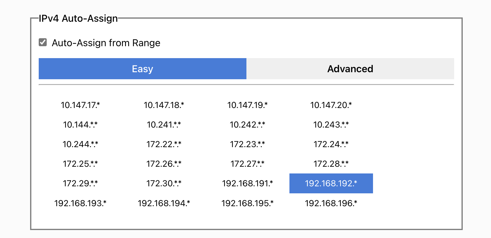
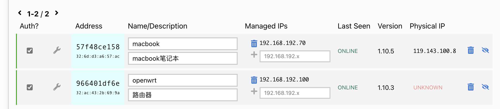
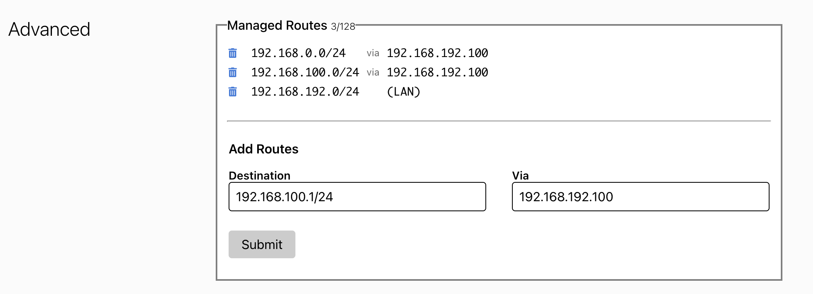
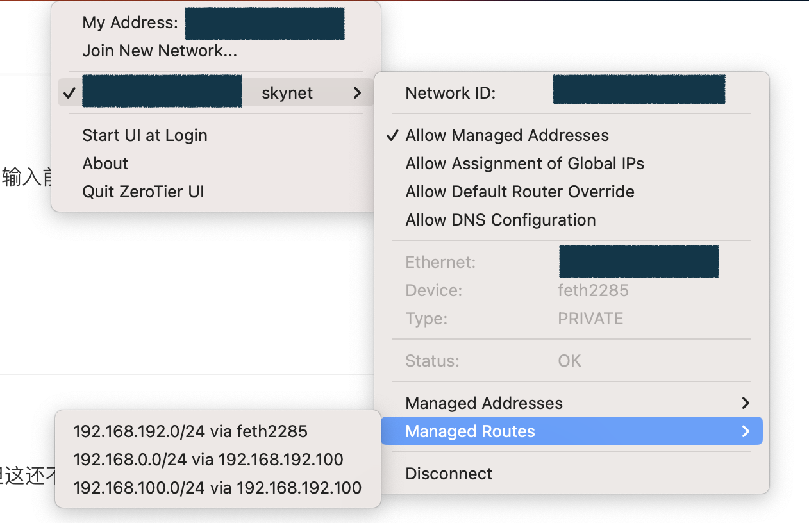

## 准备工作

### 注册帐号

我直接用 github 帐号登录。

### 创建网络

登录后提示创建一个新的网络，选择 private，可以修改网络名字如我改为 skynet 。

ipv4 自动分配地址，选择一个网段。



记录下这个网络的 ZeroTier Network ID。

## 安装客户端

### openwrt

打开 openwrt 的 "vpn" -< "zerotier"：

http://192.168.0.1/cgi-bin/luci/admin/vpn/zerotier 

填写 ZeroTier Network ID，勾选 启动 和 自动允许客户端 NAT， 点 "保存&应用"

连接成功后会显示 “***Zerotier 运行中***”， "接口信息" 中也可以看到相关的信息。

在 zerotier 的管理页面上，这时可以看到有一个提示 "One device has joined this network." 在设置列表中找到这个设备，勾选前面的框让认证通过。

为了方便起见，给每个设备指定固定的ip地址，方便后续直接连接。比如路由器我设置为 192.168.192.100。



### mac

下载安装 zerotier 的 app，启动后点击"Jion New Network" ，输入前面的 ZeroTier Network ID。然后同样需要在管理页面认证通过。

### windows

类似的安装应用，设置和 mac 类似。

> 貌似在路由器安装好 zerotier 之后，内网其他机器没有必要再安装 zerotier 了。

## 配置网络

### 配置路由器

在 openwrt 的设置中，我们选择了 "自动允许客户端 NAT"，但这还不够，还需要在 zerotier 的管理页面中对网络进行路由设置。

默认情况会有一个 managed route , "192.168.192.0/24(LAN)"。

我的路由器的内网中有两个子网，分别是 "192.168.0.0/24" 和  "192.168.100.0/24"，为了在其他设备上直接访问这些网段，需要添加两个人 route，如下图所示：



>  备注：这里的 192.168.192.100 是前面设置的路由器在 zerotier 网络中的固定IP。

可以通过 mac 上的 zerotier app 看到这些路由信息：



由于这些路由信息的存在，因此我们可以直接使用这些内网 IP 地址进行访问，好处就是可以在外网得到和在内网一样的体验。

### 网速延迟 

以广州南沙的 openwrt 软路由机器为基础进行测试，使用的是电信网络。

ping 天河的节点，同是电信宽带，延迟为 5-6 毫秒。同城电信网络之间的 ping 值非常好，甚至比家里用无线网络的延迟都低，如果不是受限于上行带宽，体现和普通局域网基本一致：

```bash
$ ping 192.168.192.20
PING 192.168.192.20 (192.168.192.20): 56 data bytes
64 bytes from 192.168.192.20: seq=0 ttl=64 time=4.922 ms
64 bytes from 192.168.192.20: seq=1 ttl=64 time=6.178 ms
64 bytes from 192.168.192.20: seq=2 ttl=64 time=4.929 ms
64 bytes from 192.168.192.20: seq=3 ttl=64 time=5.432 ms
64 bytes from 192.168.192.20: seq=4 ttl=64 time=5.480 ms
64 bytes from 192.168.192.20: seq=5 ttl=64 time=5.759 ms
```

ping 两台放在苏州的节点，也是电信宽带，延迟为 30 毫秒，考虑广州到苏州的距离，这个 ping 值还算可以的，一般用感觉不到明显延迟：

```bash
$ ping 192.168.192.30
PING 192.168.192.30 (192.168.192.30): 56 data bytes
64 bytes from 192.168.192.30: seq=0 ttl=64 time=29.429 ms
64 bytes from 192.168.192.30: seq=1 ttl=64 time=29.653 ms
64 bytes from 192.168.192.30: seq=2 ttl=64 time=29.981 ms

$ ping 192.168.192.40
PING 192.168.192.40 (192.168.192.40): 56 data bytes
64 bytes from 192.168.192.40: seq=0 ttl=64 time=31.140 ms
64 bytes from 192.168.192.40: seq=1 ttl=64 time=31.054 ms
64 bytes from 192.168.192.40: seq=2 ttl=64 time=30.939 ms
64 bytes from 192.168.192.40: seq=3 ttl=64 time=30.856 ms
64 bytes from 192.168.192.40: seq=4 ttl=64 time=31.451 ms

```

ping 用手机 USB 共享网络的放在上海青浦办公室的网络设备，延迟低时有 40 毫秒，但非常不稳定，估计是手机网络的问题：

```bash
$ ping 192.168.192.50
PING 192.168.192.50 (192.168.192.50): 56 data bytes
64 bytes from 192.168.192.50: seq=0 ttl=64 time=41.940 ms
64 bytes from 192.168.192.50: seq=1 ttl=64 time=41.611 ms
64 bytes from 192.168.192.50: seq=2 ttl=64 time=816.259 ms
64 bytes from 192.168.192.50: seq=3 ttl=64 time=224.184 ms
64 bytes from 192.168.192.50: seq=4 ttl=64 time=99.026 ms
64 bytes from 192.168.192.50: seq=5 ttl=64 time=58.053 ms
64 bytes from 192.168.192.50: seq=6 ttl=64 time=43.430 ms
64 bytes from 192.168.192.50: seq=7 ttl=64 time=47.531 ms
64 bytes from 192.168.192.50: seq=8 ttl=64 time=141.978 ms
64 bytes from 192.168.192.50: seq=9 ttl=64 time=40.104 ms
```

### 常见后续操作 (至关重要)

仅仅在命令行加入网络是不够的，在 OpenWrt 上你通常还需要进行以下两步操作，才能让局域网设备互通：

1.  **创建接口**：

    你需要去 LuCI (网页后台) -> **网络** -> **接口** -> **添加新接口**。
    *   协议：不配置协议 (Unmanaged) 或 静态地址 (Static address)。
    *   设备：选择 `zerotier-cli listnetworks` 里看到的那个设备名 (如 `ztwdk...`)。

2.  **配置防火墙**：

    去 **网络** -> **防火墙**。
    *   将刚才新建的接口加入到一个区域（通常是新建一个 VPN 区域，或者为了方便直接加入 LAN 区域，并允许 `Masquerading` 动态伪装）。

### 总结流程

1. `zerotier-cli info` 获取 ID。
2. 在 ZeroTier 官网后台授权该 ID。
3. `uci add_list ...` 添加网络 ID 并重启服务。
4. `zerotier-cli listnetworks` 确认状态为 OK 且有虚拟网卡名。
5. 在 OpenWrt 网页后台配置接口和防火墙。

